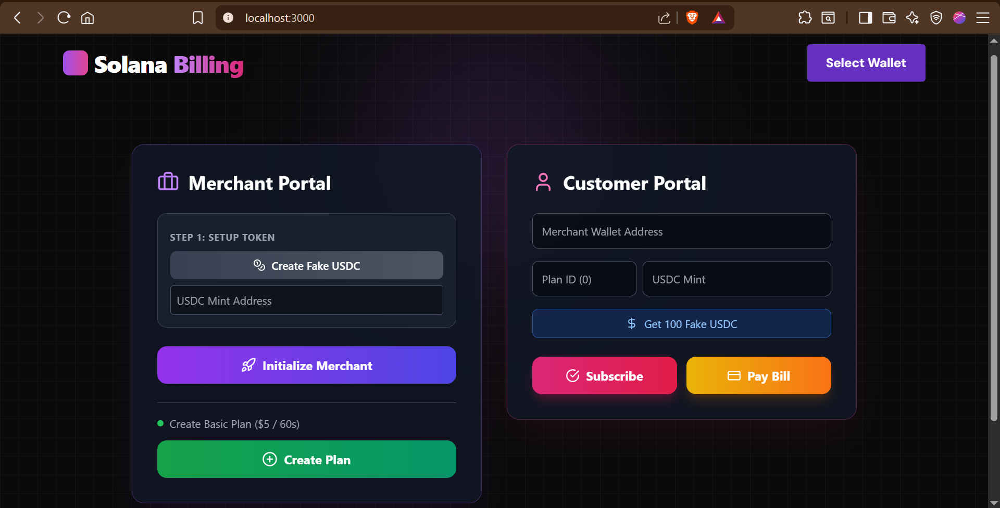
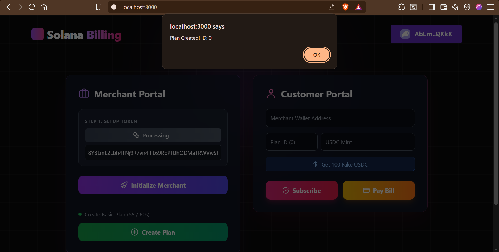
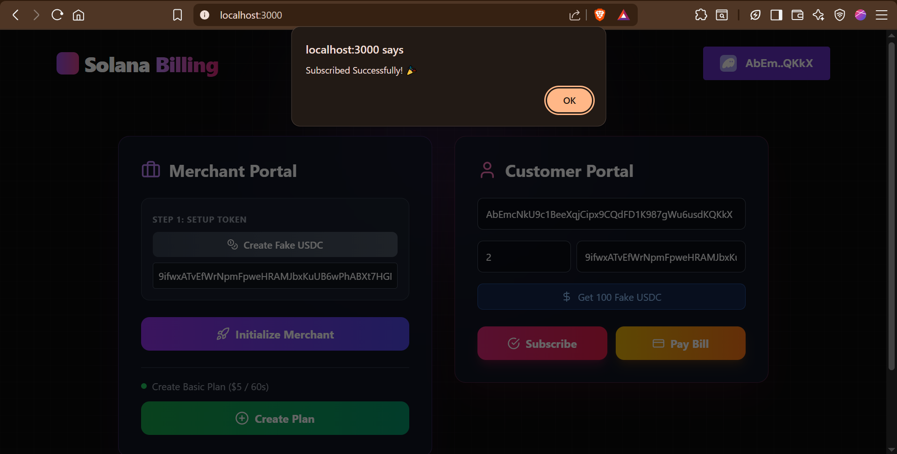
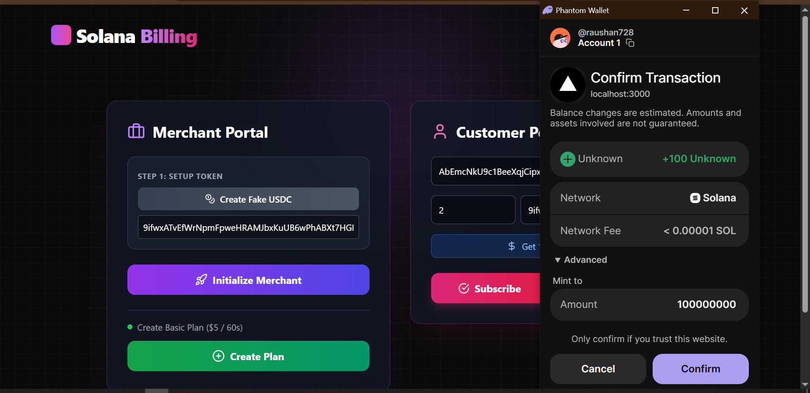

<p align="center">
  
  
  
  
  
  
  
</p>

---

## Quick Navigation

- [Home](#solana-web3-billing-protocol)
- [System Architecture](#system-architecture)
- [Installation Guide](#installation-guide)
- [Configuration Guide](#configuration-guide)
- [Visual Walkthrough](#visual-walkthrough)
- [Troubleshooting](#troubleshooting)

# Solana Web3 Billing Protocol



## Introduction

Welcome to the **Solana Web3 Billing Protocol**, a cutting-edge decentralized application (dApp) designed to revolutionize how recurring payments are handled on the blockchain.

In the traditional Web2 world, services like Stripe Billing handle subscriptions by storing user credit card data and charging them periodically. This centralized model relies on trust and intermediaries. The **Solana Web3 Billing Protocol** moves this entire logic on-chain, leveraging the speed and low cost of the Solana blockchain to create a trustless, automated, and transparent billing infrastructure.

**Why is this important?**
*   **Decentralization**: No central authority controls the billing logic. It is immutable and governed by smart contracts.
*   **Security**: Users pay with their non-custodial wallets. No sensitive data (like credit card numbers) is ever stored.
*   **Transparency**: Every subscription creation, payment, and cancellation is recorded on the blockchain and verifiable by anyone.
*   **Automation**: Smart contracts automatically handle the logic for valid subscription periods, ensuring access is granted only when payment is confirmed.

This project serves as a comprehensive reference implementation for developers looking to build SaaS (Software as a Service) platforms, membership sites, or any application requiring recurring revenue models on Solana.

## Key Features

*   **Merchant Plan Creation**:
    *   Merchants can deploy their own "Plan" accounts on-chain.
    *   Flexible configuration: Set the plan name, description, price (in USDC), and duration (e.g., 30 days).
    *   Full control: Merchants are the authorities of their plans.
*   **PDA-Based Subscription Management**:
    *   Uses **Program Derived Addresses (PDAs)** to deterministically generate account addresses.
    *   Ensures that a specific user + specific plan always maps to the same unique subscription account.
    *   Prevents collisions and ensures secure data access.
*   **Time-Based Billing Logic**:
    *   Smart contracts utilize the on-chain `Clock` sysvar to track time.
    *   Subscriptions have a `start_time` and `end_time`.
    *   The system automatically calculates if a subscription is active or expired based on the current block time.
*   **USDC Payment Integration**:
    *   Built to work with SPL Tokens, specifically USDC (or any standard SPL token).
    *   Handles secure token transfers from the customer's wallet to the merchant's wallet.

## System Architecture

Understanding the underlying architecture is crucial for developers. This protocol uses the **Anchor Framework**, which simplifies Solana development by enforcing security checks and standardizing account structures.

### Account Structure & Relationships

The system is built around four main account types, linked together via PDAs:

1.  **Merchant Account (Authority)**
    *   **Role**: Represents the owner/admin of the service.
    *   **Data**: Stores the merchant's wallet address.
    *   **Signer**: Required to initialize plans.

2.  **Plan Account**
    *   **Role**: Defines a subscription tier (e.g., "Basic", "Pro").
    *   **Derivation (PDA)**: Derived from the string `"plan"`, the Merchant's public key, and a unique identifier (e.g., "plan-1").
    *   **Data**:
        *   `owner`: The merchant's public key.
        *   `price`: Cost in USDC (atomic units).
        *   `duration`: Length of the subscription in seconds.

3.  **Subscription Account**
    *   **Role**: The record of a user's purchase.
    *   **Derivation (PDA)**: Derived from the string `"subscription"`, the Plan's public key, and the Customer's public key.
    *   **Data**:
        *   `customer`: The user's public key.
        *   `plan`: The plan being subscribed to.
        *   `start_time`: Unix timestamp of purchase.
        *   `end_time`: Unix timestamp of expiration.
        *   `is_active`: Boolean status.

4.  **Invoice Account**
    *   **Role**: A receipt for a specific payment.
    *   **Derivation (PDA)**: Derived from `"invoice"`, the Subscription public key, and the current timestamp.
    *   **Data**: Immutable record of the amount paid and time.

## Prerequisites

Before you begin, you must have a development environment set up. If you are new to Solana development, follow these steps carefully.

### 1. Operating System
*   **Linux (Ubuntu/Debian)**: Recommended.
*   **macOS**: Supported.
*   **Windows**: Must use **WSL2** (Windows Subsystem for Linux). Native Windows is not fully supported for Anchor development.

### 2. Install Rust
Rust is the programming language used for Solana smart contracts.

```bash
curl --proto '=https' --tlsv1.2 -sSf https://sh.rustup.rs | sh
# Select option 1 (default)
source $HOME/.cargo/env
rustc --version
# Output should be 1.70.0 or higher
```

### 3. Install Solana CLI
The Command Line Interface for interacting with the Solana blockchain.

```bash
sh -c "$(curl -sSfL https://release.solana.com/v1.18.4/install)"
# Add to path if prompted
solana --version
```

### 4. Install Node.js & Yarn
Required for the frontend (Next.js) and testing scripts.

```bash
# Using NVM (Node Version Manager) is recommended
curl -o- https://raw.githubusercontent.com/nvm-sh/nvm/v0.39.3/install.sh | bash
source ~/.bashrc
nvm install 18
nvm use 18
node --version
# Install Yarn
npm install -g yarn
```

### 5. Install Anchor Framework
The framework for building Solana programs.

```bash
cargo install --git https://github.com/coral-xyz/anchor avm --locked --force
avm install latest
avm use latest
anchor --version
```

## Installation Guide

Now that your environment is ready, let's set up the project.

### Step 1: Clone the Repository

Use the official repository URL to get the source code.

```bash
git clone https://github.com/raushan728/solana-web3-billing.git
cd solana-web3-billing
```

### Step 2: Project Structure Overview

Take a moment to understand the folder structure:

*   `programs/`: Contains the Rust smart contract code (`lib.rs`).
*   `app/`: Contains the Next.js frontend application.
*   `tests/`: Contains TypeScript integration tests.
*   `Anchor.toml`: Main configuration file for the workspace.

### Step 3: Install Backend Dependencies

Install the Rust crates required for the smart contract.

```bash
# From the root directory
anchor build
```
*Note: This first build might take a few minutes as it compiles all dependencies.*

### Step 4: Install Frontend Dependencies

Move to the `app` folder to install the web application packages.

```bash
cd app
npm install
# or
yarn install
```

## Configuration Guide

> [!IMPORTANT]
> **CRITICAL STEP**: If you skip this, your frontend will not be able to talk to your smart contract.

When you build an Anchor program, it generates a unique **Program ID** (Public Key). You must update your code to use this specific ID.

### 1. Get Your Program ID
After running `anchor build`, a keypair is generated in `target/deploy/`.

```bash
# From the root directory
solana address -k target/deploy/solana_billing-keypair.json
```
*Copy the output address (e.g., `Fg6PaFpoGXkYsidMpWTK6W2BeZ7FEfcYkg476zPFsLnS`).*

### 2. Update the Smart Contract (`lib.rs`)
Open `programs/solana_billing/src/lib.rs`.

```rust
use anchor_lang::prelude::*;

// REPLACE THIS STRING with your copied address
declare_id!("Fg6PaFpoGXkYsidMpWTK6W2BeZ7FEfcYkg476zPFsLnS");

#[program]
pub mod solana_billing {
    // ...
}
```

### 3. Update `Anchor.toml`
Open the `Anchor.toml` file in the root directory.

```toml
[programs.localnet]
solana_billing = "Fg6PaFpoGXkYsidMpWTK6W2BeZ7FEfcYkg476zPFsLnS"
```

### 4. Re-build the Program
Since you changed the source code (`lib.rs`), you must build again to bake in the new ID.

```bash
anchor build
```

### 5. Update Frontend Constants
Open `app/utils/constants.ts`.

```typescript
import { PublicKey } from "@solana/web3.js";

// REPLACE THIS with your copied address
export const PROGRAM_ID = "Fg6PaFpoGXkYsidMpWTK6W2BeZ7FEfcYkg476zPFsLnS";
```

## Wallet Setup (Local Development)

To test this application, you need a Solana wallet with some "fake" money (SOL) on the Localnet.

1.  **Start the Local Validator**:
    Open a new terminal window and keep this running.
    ```bash
    solana-test-validator
    ```

2.  **Configure Solana CLI to Localhost**:
    ```bash
    solana config set --url localhost
    ```

3.  **Create a File System Wallet (if you don't have one)**:
    ```bash
    solana-keygen new -o ~/.config/solana/id.json
    ```

4.  **Airdrop SOL**:
    Give yourself some tokens to pay for transactions.
    ```bash
    solana airdrop 10
    ```

5.  **Deploy the Program**:
    ```bash
    anchor deploy
    ```

## Visual Walkthrough & Usage

This section guides you through the application flow. Ensure your frontend is running:

```bash
cd app
npm run dev
```
Open `http://localhost:3000` in your browser.

### Phase 1: Merchant Setup

**Goal**: Initialize the store and create a subscription plan.

**Pre-requisites**:
*   You must have a Solana Wallet extension installed in your browser (e.g., Phantom or Solflare).
*   Switch your wallet network to **Localhost** (Settings -> Developer Settings -> Change Network).
*   Airdrop some SOL to your browser wallet address (`solana airdrop 5 <YOUR_WALLET_ADDRESS>`).

**Action**:
1.  Connect your wallet using the "Select Wallet" button.
2.  Navigate to the "Merchant Dashboard".
3.  Fill in the Plan details (Name, Price in USDC, Duration).
4.  Click "Create Plan".


*Above: The interface where merchants define the terms of the subscription.*

### Phase 2: Customer View

**Goal**: A user views the available plans.

**Context**:
Once a plan is created on-chain, it is public. Any user who visits the dApp can fetch the plan account and see the details.

**Action**:
1.  (Optional) Switch to a different wallet account in Phantom to simulate a "Customer".
2.  Ensure the Customer wallet has SOL (for gas) and USDC (for payment).
    *   *Dev Tip*: You can mint fake USDC to your wallet using spl-token CLI tools if testing on Devnet, or use the mock-usdc feature if enabled in the contract.


*Above: The customer sees the plan details fetched directly from the blockchain.*

### Phase 3: Payment & Subscription

**Goal**: Execute the transaction to subscribe.

**What happens under the hood?**:
1.  The frontend constructs a transaction with two main instructions:
    *   `Transfer`: Moves USDC from Customer to Merchant.
    *   `Subscribe`: Calls the smart contract to create the `Subscription` PDA.
2.  The user is prompted to sign the transaction.

**Action**:
1.  Click the "Subscribe" button.
2.  Approve the transaction in your wallet popup.
3.  Wait for confirmation (usually < 1 second on Solana).


*Above: The wallet approval screen showing the transfer of funds and program interaction.*

## Testing

Automated tests are crucial for smart contracts. We use the Anchor testing framework (Mocha/Chai).

To run the full test suite:

```bash
anchor test
```

**What is being tested?**
*   **Initialization**: Can the merchant create a plan?
*   **Subscription**: Can a user subscribe successfully?
*   **Payment**: Are tokens actually transferred?
*   **Restrictions**: Does the system fail if a user tries to subscribe without paying?
*   **Expiry**: Does the system correctly identify an expired subscription?

## Troubleshooting

Common issues you might encounter:

**1. "Account not found" or "Program not deployed"**
*   **Cause**: You restarted `solana-test-validator` but didn't redeploy the program.
*   **Fix**: Run `anchor deploy` again.

**2. "Signature verification failed"**
*   **Cause**: The Program ID in `lib.rs` does not match the keypair in `target/deploy`.
*   **Fix**: Check the [Configuration Guide](#configuration-guide) and ensure IDs match everywhere.

**3. "Wallet not connected"**
*   **Cause**: Browser extension not detecting the local network.
*   **Fix**: Ensure Phantom/Solflare is set to "Localhost" or "Devnet" depending on where you are running.

**4. Node.js Version Errors**
*   **Cause**: Using an old version of Node.
*   **Fix**: Run `nvm use 18` before running `npm install`.

## Contributing

We welcome contributions! Please follow these steps:
1.  Fork the repository.
2.  Create a feature branch (`git checkout -b feature/amazing-feature`).
3.  Commit your changes.
4.  Push to the branch.
5.  Open a Pull Request.

## License

This project is licensed under the MIT License - see the [LICENSE](LICENSE) file for details.